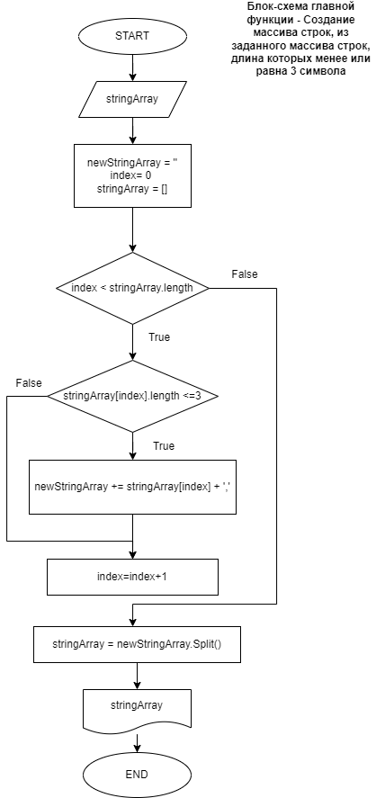

# Инструкция для работы с программой, принимающей на вход массив из строк и формирующей на выходе массив из строк, длина которых  3 или менее символов.

## Блок-схема основного алгоритма
**algorithm.png** - представляет блок-схему работы основной функции программного кода

## Подготовка репозитория
Для **создание репозитория** необходимо выполнить команду *git init*  в папке с репозиторием и у Вас создаться репозиторий (появится скрытая папка **.git**)

